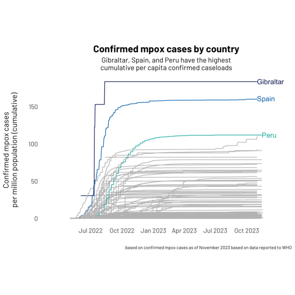

## Cumulative monkeypox cases

Based on data from: Kumar A, Ross JS, Patel NA, Rathi V, Redberg RF, Dhruva SS. Studies Of Prescription Digital Therapeutics Often Lack Rigor And Inclusivity: Study examines prescription digital therapeutics standards. Health Affairs. 2023 Nov 1;42(11):1559-67.

  

The making of this visualisation was recorded using the {camcorder} package.

  

