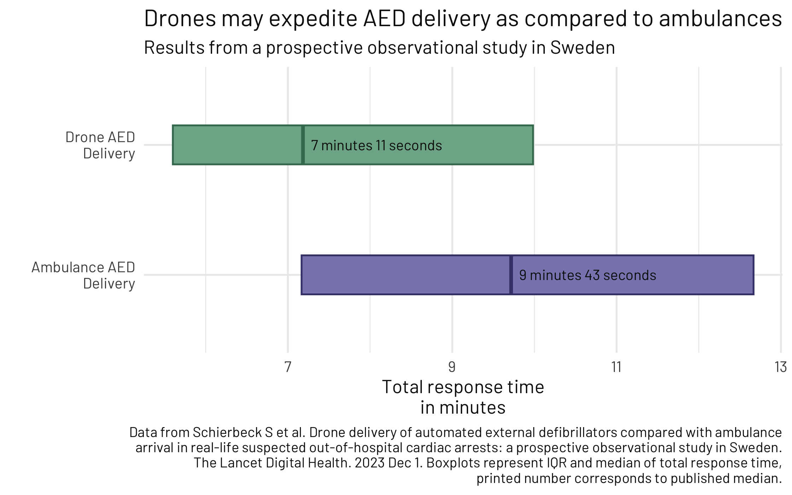

## Cumulative monkeypox cases

Based on data from: Schierbeck S, Nord A, Svensson L, Ringh M, Nordberg P, Hollenberg J, Lundgren P, Folke F, Jonsson M, Forsberg S, Claesson A. Drone delivery of automated external defibrillators compared with ambulance arrival in real-life suspected out-of-hospital cardiac arrests: a prospective observational study in Sweden. The Lancet Digital Health. 2023 Dec 1;5(12):e862-71.

  

