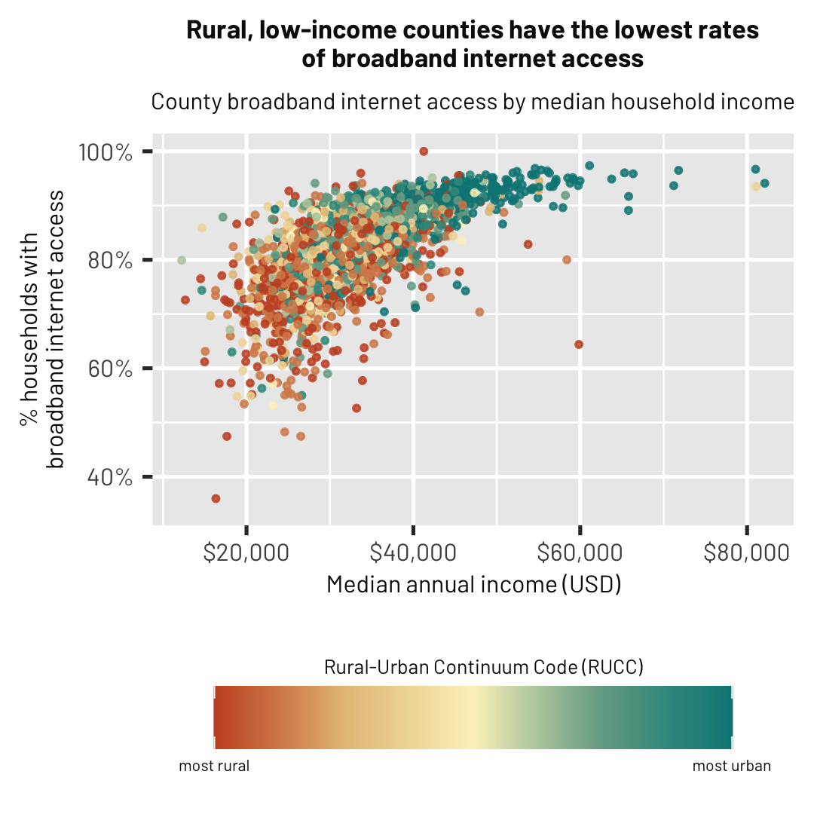

## Dataset

<h1 align="center">Broadband internet access rates by county</h1>

**Citation** American Community Survey Dataset, 2022
Inspiration from this plot came from work by Jeremy Ney and the Harvard Social Policy Lab [https://www.socialpolicylab.org/post/internet-access-and-inequality]
Additional data on urban-rural designations was obtained from the [USDA Economic Research Service](https://www.ers.usda.gov/data-products/rural-urban-continuum-codes/) on February 26, 2023

  

The making of this visualisation was recorded using the {camcorder} package.

  

