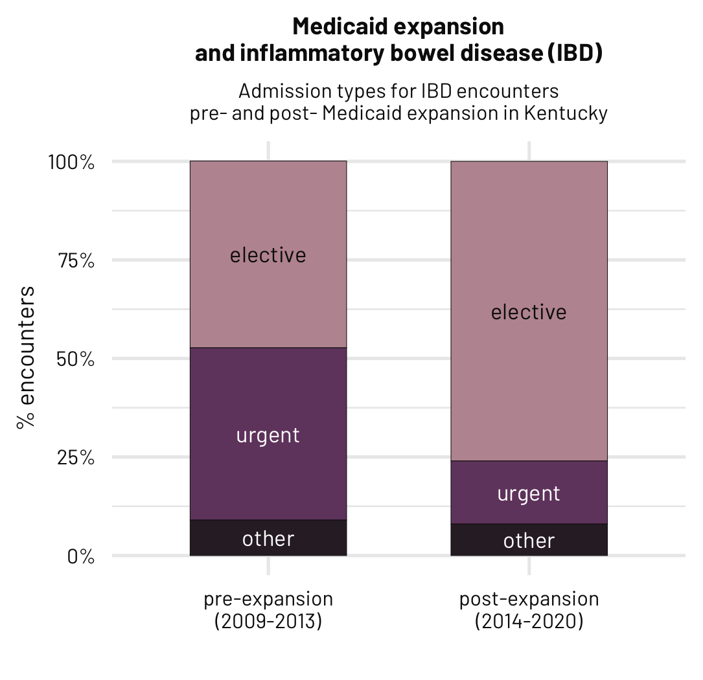
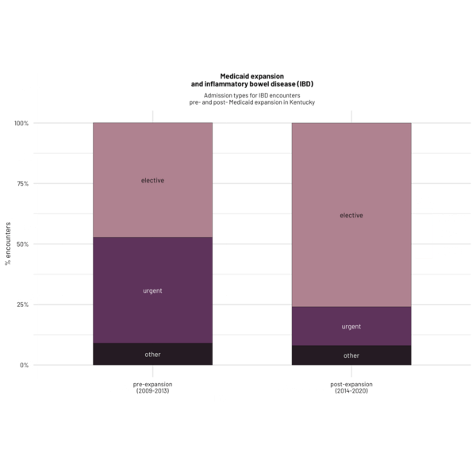

## Dataset

<h1 align="center">Medicaid expansion and treatment of inflammatory bowel disease</h1>

**Citation** Levy BE, Mangino AA, Castle JT, Stephens WA, McDonald HG, Patel JA, Beck SJ, Bhakta AS. Effect of Medicaid expansion on inflammatory bowel disease and healthcare utilization. The American Journal of Surgery. 2024 Jan 18.

  

The making of this visualisation was recorded using the {camcorder} package.

  

