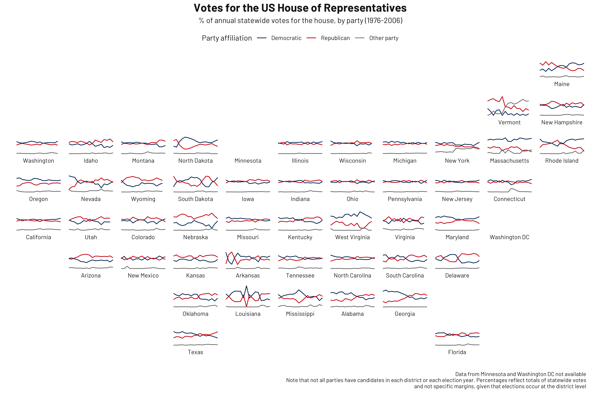

## About TidyTuesday

`TidyTuesday` is a weekly social data project hosted and organized by the R4DS Data Science community. The overarching goal of TidyTuesday is to make learning to work with data easier by providing real-world datasets.

New data are posted every Monday morning. You can use these data to create a visualization, a model, a shiny app, or some other piece of data-science-related output, using R or another programming language. For more information on TidyTuesday, please see the [rfordatascience/tidytuesday github repository](https://github.com/rfordatascience/tidytuesday).

## Data Viz Examples

